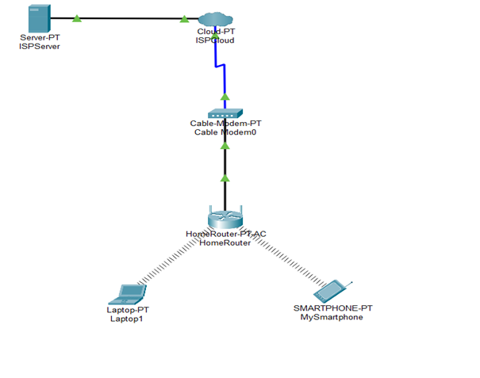
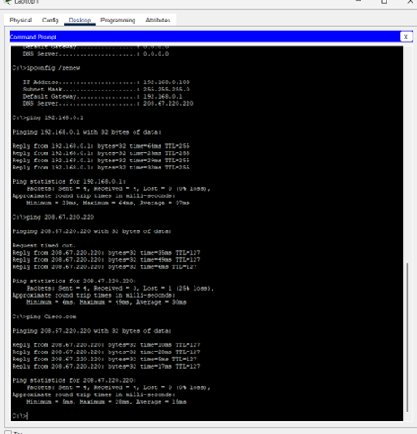
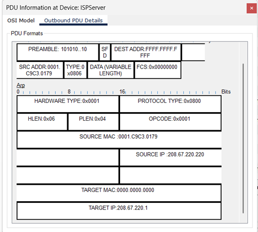
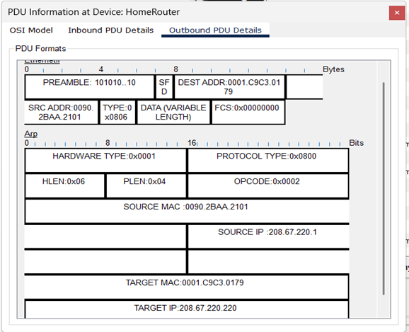
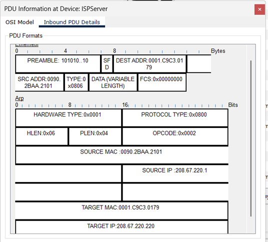
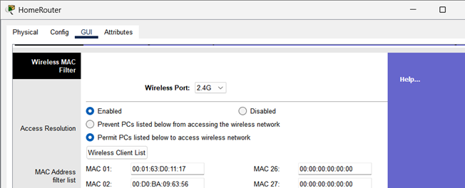
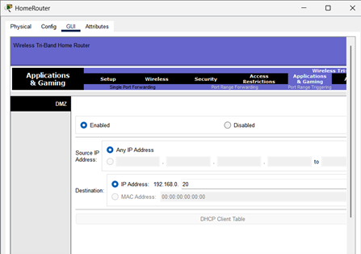
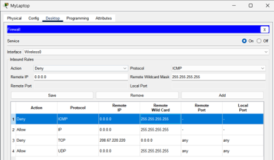
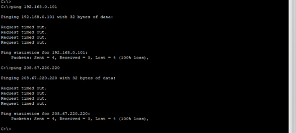
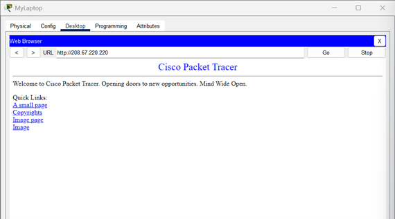

 
# Introduction to Home Networks: Simulation and Analysis
## Home Network Traffic Analysis
 
## Introduction
The contemporary digital environment has drastically changed how people engage with technology and home networks are now essential for a wide range of everyday tasks, from entertainment and smart home automation to distant work and online education. Because of this widespread dependence, it is vital to comprehend the fundamental ideas behind these networks to use and troubleshoot them effectively and most importantly to build strong security postures. Intricate interactions between different hardware components and software protocols make up home networks' underlying architecture, even though they sometimes seem like smooth channels for digital contact. Users lack the knowledge necessary to identify connectivity problems, enhance network performance, or put in place crucial defences against online attacks if they do not understand these basics.
In the setting of a normal house, this project provides a theoretical and practical introduction to these fundamental networking principles. The main goals are as follows: first, to give a strong theoretical basis of networking concepts that are directly applicable to a home setup; second, to use the industry-standard Cisco Packet Tracer simulation tool to practically simulate a basic home network, which consists of a laptop and a smartphone connected to a wireless router; third, to analyse network traffic in this simulated environment, gain concrete understanding of the workings of various network protocols; and fourth, to show how basic firewall rules can be implemented to improve the home network's security.
This project's concentration is on a small-scale home network, with a particular emphasis on how a wireless router, a single laptop and a single smartphone interact. The selected tool, Cisco Packet Tracer, is well known for their capacities to simulate networks and analyse traffic, respectively, in both professional practice and network education. The project's security component will focus on presenting firewall concepts and setting up fundamental rules at the host and router levels, giving participants a basic grasp of network defence. These topics will be methodically covered in the parts that follow, starting with the theoretical foundations, moving on to real-world simulation and analysis, and ending with crucial security implementations.
 
### 1.	Theoretical Foundations of Home Networking
This section lays out the theoretical groundwork required to understand how home networks work, exploring fundamental networking ideas, the roles of different network devices, and the various topologies and transmission techniques used.

#### 1.1.	Core Networking Concepts
In its most basic form, a computer network is a group of linked computing devices that may share resources and exchange data. The Internet itself, which is a huge, linked network of many computer networks, is a worldwide example of this idea. In the domestic environment, a home network is a configuration that connects devices in a house so they may interact with one another and share resources like files, printers, and internet access. This usually includes gadgets such as smart TVs, smartphones, tablets, personal computers, and other Internet of Things (IoT) devices. To facilitate local communication and resource sharing without necessarily depending on external networks like the internet, a local area network (LAN) is a more specific classification that refers to a network that connects devices within a confined geographical area, such as a home, office, or school campus.

A conceptual framework known as the Open Systems Interconnection (OSI) model organises the procedures required for computers and network technologies to interact with a variety of hardware and applications. The seven different layers that make up this model—Physical, Data Link, Network, Transport, Session, Presentation, and Application—each have a specialised function.

### 1.2.	Data Link Layer
As the second layer of the OSI architecture, the Data Link Layer, often known as Layer 2, occupies a crucial role. Its main duty is to ensure that data is reliably sent over the Physical Layer between network nodes that are linked. This layer makes sure that the raw data bits delivered by the Physical Layer are properly arranged and conveyed as frames, which are coherent data packets. It actively takes part in data transfer segmentation, monitoring, and problem-solving. Comparable to a "neighbourhood traffic cop," the Data Link Layer mediates access to a shared physical medium without considering the destination of the data. 

This layer can identify and potentially fix faults that may arise in the Physical Layer and offers the functional and procedural methods of data transfer between network entities. For higher-level protocols, the Data Link Layer's operations are essential to enabling the Physical Layer, which is intrinsically unstable. Without Layer 2's error-detection (e.g., Cyclic Redundancy Check), data-structuring (framing), and frame-retransmission (Automatic Repeat Request) methods, Layer 1's raw bit stream would be too error-prone for useful communication. This emphasises the function of Layer 2 as a crucial abstraction layer that offers the Network Layer (Layer 3) a dependable connection service.

The Data Link Layer is typically subdivided into two sublayers:
At the top of the data link layer, multiplexing protocols are managed by the upper sublayer known as Logical Link Control (LLC). Error reporting, acknowledgement and flow control are options. The LLC controls the data link's addressing and control, defining the methods for addressing stations over the transmission channel and regulating data transfer between the machines that send and receive data. 

Controlling access to the physical media is the responsibility of the lower sublayer, Media Access Control (MAC). Carrier Sense Multiple Access with Collision Detection (CSMA/CD) is used for detecting collisions in Ethernet networks, whereas Carrier Sense Multiple Access with Collision Avoidance (CSMA/CA) is used for preventing collisions in wireless networks. The MAC sublayer also manages frame synchronization, which involves determining the start and end of each data frame in the transmission bitstream. It is also responsible for physical addressing, which refers to MAC addressing.

Key functions provided by the Data Link Layer include:
•	Encapsulation: To be ready for transmission via the physical channel, network layer data packets are packaged into frames. 
•	Frame synchronisation which ensures that the data frames in the bitstream are properly aligned and delineated.
•	Error Control: This is provided by the LLC sublayer and comprises error detection/packet cancelling from all levels, forward error correction (FEC) algorithms from the physical layer, and Automatic Repeat Request (ARQ) for retransmission of incorrect packets. Because bit mistakes are uncommon on short cable connections, LAN protocols like Ethernet usually simply offer error detection and cancellation of erroneous packets, even if wireless networks and modems offer error management.
•	Flow Control: This mechanism, which is provided by the LLC sublayer, controls the data flow to avoid flooding an overloaded receiver with information. Like error control, data-link-layer flow control is used in modems and wireless networks but is less popular in LAN Ethernet. 
•	By giving devices distinct hardware addresses, physical addressing, also known as MAC addressing, makes it easier for frames to be delivered locally. 
•	LAN switching: Allows for effective data forwarding inside a local network segment and includes packet switching, MAC filtering, and virtual LANs (VLANs).

#### 1.2.1.	IP Address
To enable communication, every device on a network needs its own IP address. This assignment is mostly automated in contemporary networks by the Dynamic Host Configuration Protocol (DHCP). In addition to other crucial network settings like the subnet mask, default gateway, and DNS server addresses, DHCP is a network service that keeps track of a pool of accessible IP addresses and dynamically leases these configurations to client devices. By automating the process, configuration errors are greatly reduced, and administrators no longer have to manually assign network settings to each device. 

#### 1.2.2.	DHCP
DHCP is especially important for facilitating device connection in the context of a home network. Most of Small Office/Home Office (SOHO) internet routers are equipped with a DHCP service, which assigns IP addresses to common household devices like PCs, tablets, smartphones, and Internet of Things equipment automatically. The fact that contemporary home networks are "plug-and-play" is made possible in large part by this automation. Without it, it would be necessary to manually configure default gateways, subnet masks, and unique, non-conflicting IP addresses for each new device, increasing complexity and the possibility of user mistake. Without requiring technical understanding of network settings, consumers may connect devices thanks to this abstraction of network configuration. 

Often abbreviated as DORA, the DHCP lease generation process normally consists of four steps:

Discover: To find any accessible DHCP servers, the client device broadcasts a query packet over the network to start the process. 

Offer: A DHCP server provides the client with an available IP address and further configuration parameters in response to the discover query. 

Request: Next, the client formally asks the DHCP server to grant them access to the provided IP address. 

Lastly, the DHCP server identifies the IP address as leased in its database, validates the IP address assignment, and acknowledges the client's request. 

To make sure their leased IP address settings are still valid, DHCP clients must communicate with the DHCP server on a regular basis. Usually, just the "Request" and "Acknowledge" phases of the DORA sequence are used in this lease renewal procedure.

#### 1.2.3.	Network Topologies
Network topology refers to the configuration of nodes and links in a computer network, indicating the logical or physical connections between devices. It is essential to understand these topologies to design and troubleshoot a home network.

Home network topologies include star topology, which connects all devices to a central hub, but is vulnerable if the central device fails. Bus topology, used in early Ethernet networks, connects all devices to a single main cable, but is non-robust as a failure can cause the entire network to crash. The star-bus hybrid topology, used in modern Ethernet and Wi-Fi networks, combines elements of both topologies, connecting devices in a star configuration to a central switch, forming a bus-like network.

Networks can operate based on two logical models: the Client-Server Model and the Peer-to-Peer Model. The Client-Server Model involves a central server hosting resources for client devices, offering enhanced security, easier resource location, and simplified data backup. This model requires a network administrator, expensive hardware, and a single point of failure. Smart home devices often use this model, connecting to central cloud-based servers for configuration and control. The Peer-to-Peer Model allows each computer to function as both a client and server, offering ease of setup, lack of a central administrator, and a single point of failure. However, it can be more secure, difficult to locate resources, and complicate data backup.

#### 1.2.4.	Transmission Methods
Wired networks are physical connections that offer speed, reliability, security, and consistent connections. They are ideal for applications requiring steady data transfer rates, such as online gaming or video conferencing. However, they can be expensive labour-intensive and require physical space for cables and equipment. Wireless networks, on the other hand, use radio waves to connect devices, offering convenience, mobility, and aesthetics. They are typically slower and less reliable than wired networks, but can be susceptible to interference, security risks, limited range, and battery life dependence.

The evolution of Wi-Fi standards, defined by the IEEE 802.11 family, has led to advancements in theoretical speeds, device capacity, and efficiency in dense environments. The first standard, 802.11n, achieved theoretical maximum data rates of up to 600 Mbps, using Multiple-Input, Multiple-Output (MIMO) technology. The second standard, 802.11ac, pushed speeds beyond 1 Gbps, focusing on Multi-User MIMO (MU-MIMO) and wider channel widths. The third standard, 802.11ax, reached theoretical speeds of up to 9.6 Gbps, focusing on optimizing network capacity and performance under load.

Future standards, such as Wi-Fi 7 - 802.11be, aim to utilize the 2.4 GHz, 5 GHz, and 6 GHz bands, promising even greater speeds and efficiency. This progression of Wi-Fi standards demonstrates a consistent trend towards improving network performance and capacity under real-world, multi-device loads, which is increasingly important for modern smart homes.

### 1.3.	Home Network Devices and Their Functions
To provide connectivity and communication, several essential hardware components are necessary for effective home networking.

As the link between the home network and the wider Internet, the modem (modulator-demodulator) is a basic piece of hardware. Its primary function is to adapt data signals from the Internet Service Provider (ISP) to a format that the devices connected to the home network can use, and vice versa. 

Most home networks are built on top of the router, which serves as their main hub. It serves as a gateway, placing itself between the modem and the local network devices and guiding internet traffic to the right devices inside the home network. In addition to controlling traffic, the router oversees allocating IP addresses to devices (often through an integrated DHCP server), controlling data flow, and offering essential security measures, such as integrated firewalls, to guard against unwanted network access. Data packet routing between various networks is the main function of routers, which are mostly located at Layer 3 (the Network Layer) of the OSI model. 

A switch is a networking device that uses Ethernet wires to link several devices together inside a single local area network (LAN). Its purpose is to properly route data packets to their designated locations inside the LAN by transferring incoming and outgoing internet traffic between the connected devices. In the OSI model, switches function at Layer 2, or the Data Link Layer. Switches can be used to increase the number of accessible wired connections, especially in bigger installations or when several connected devices are present, even though a single router is often adequate for delivering internet access in a basic home network. 

To allow devices to connect to the network wirelessly using Wi-Fi, a wireless access point (WAP) transforms a wired network signal into a wireless one. By increasing a computer network's wireless reach and capacity, WAPs enable additional devices to connect. In a lot of home network configurations, the wireless router itself incorporates WAP capability.

Combining the features of a modem, router, switch, and wireless access point into a single integrated home gateway device is becoming more common among manufacturers and ISPs. Because they only must manage one device for their local network and internet connectivity requirements, end users find the setup procedure easier because of this consolidation. However, the integrated device turns into a single point of failure because of this convenience. If this device malfunctions, it can interfere with all facets of the home network's connectivity, impacting internet access as well as local device communication. A crucial factor in home network architecture is the trade-off between easier installation and possible centralised points of failure.

 
## 2.	Practical Part
This section offers an explanation by step on how to use Cisco Packet Tracer, a potent network simulation tool, to design, construct, and configure a simple home network. The procedures for configuring IP addresses and confirming network connectivity will also be covered.

### 2.1.	Designing and Building the Home Network Topology

###### Figure 1: Cisco Packet Tracer Network Diagram
######  Source: Own

##### Figure 1 presents a graphical representation of the simulated home network topology in Cisco Packet Tracer. This diagram visually depicts the Wireless Router, Laptop, Smartphone, Internet Cloud, and Server, along with the physical and wireless connections between them. Device labels and connection types are clearly indicated, providing an immediate and intuitive understanding of the network's structure and how its components are interconnected.

### 2.2 IP Configuration and Connectivity Verification
After building the topology, the next critical step is to configure the IP addresses and verify that all devices can communicate effectively within the simulated network.
#### Table 1: Simulated Home Network Addressing Table
This table documents the network configuration, providing a clear reference for IP assignments and device roles within the simulated environment.

| Device Name | IP Address | Subnet Mask | Default Gateway | Interface |
|---|---|---|---|---|
| MySmartphone | 192.168.0.101 | 255.255.255.0 | 192.168.0.1 | Wireless |
| MyLaptop | 192.168.0.103 | 255.255.255.0 | 192.168.0.1 | Wireless |
| HomeRouter | 192.168.0.1 | 255.255.255.0 | N/A | Wireless |
| ISPServer | 208.67.220.220 | 255.255.255.0 | 208.67.220.1 | FastEthernet0 |

 
##### Figure 2: Testing Network Connectivity
###### Source: Own

Figure 2 is essential proof that the simulated home network's end-to-end connection worked. It shows that the laptop's ICMP Echo Request reached the server after successfully navigating the home network, cable modem, and ISP cloud. The server's response was then appropriately sent back to the laptop. The full communication cycle is confirmed by the visible ICMP Echo Reply in the packet data.

### 2.3. Network Traffic Analysis 
This section explores how the packet tracer built-in Stimulation mode may be used to record and examine network traffic in a home network simulation. Direct monitoring of protocol processes is made possible by this method, which turns intangible networking notions into concrete facts.

 
##### Figure 3: ARP Request
###### Source: Own

Figure 3: This screenshot displays the initial state of an ARP Request packet as it is generated by the ISP Server. The Outbound PDU Details (Layer 7 to Layer 1, Out) show the encapsulation process. Key information includes the Source IP address (ISP Server's IP) and the Target IP address (Home Router's IP), along with the initial Source MAC address of the ISP server's interface. The Destination MAC address is broadcast (FFFF.FFFF. FFFF) as the ISP server does not yet know the home router's MAC address. This stage demonstrates the network layer initiating a request for MAC address resolution and its subsequent preparation for transmission down the OSI model stack.

 
###### Figure 4: Outbound ARP Reply Leaving Home Router
###### Source: Own

Figure 4: The image above displays the ARP Reply packet that the home router generates in response to a request from the ISP server. The encapsulation is seen in the Outbound PDU Details (Layer 7 to Layer 1, Out). Along with the Source MAC address of the home router's interface, other key details include the Source IP address (the IP of the home router) and the Target IP address (the IP of the ISP server). Importantly, the home router discovered the destination MAC address from the ARP request, which is now the precise MAC address of the ISP server (0001.C9C3.0179). In this step, the address resolution procedure is completed by the home router giving the ISP server its MAC address.

##### Figure 5: Inbound ARP Response Reaching the ISP Server
###### Source: Own

Figure 5: The image above shows the ARP Reply packet as soon as the ISP server receives it. Here, the Layer 2 Inbound PDU Details (Layer 1 to Layer 7, In) are crucial since they display the Destination MAC address as the interface of the ISP server. After processing this unicast response, the ISP server refreshes its ARP cache and retrieves the MAC address of the home router. This emphasises how the server receives frames and uses the MAC address that has been resolved for direct connection in the future.

###  2.4. Implementing Firewall Security
This section illustrates the fundamental principles of network firewalls and provides practical guidance on configuring basic firewall rules to significantly enhance the security posture of a home network.

#### 2.4.1. Implementing Router-Level Firewall Security (Wireless Router)
Once logged into the router's GUI, various security features can be configured. While specific menu names may vary slightly in Packet Tracer's generic router models, the underlying functionality remains consistent.

#### 2.4.1.1. MAC Filtering for Device Access Control

##### Figure 6: MAC Filtering
###### Source: Own

Figure 6 shows the Wireless MAC Filter configuration page of a home router's GUI allowing administrators to control which devices can connect to the wireless network based on their MAC addresses. The router's Wi-Fi port indicates the current Wi-Fi band, and the Enabled/Disabled radio button determines whether the MAC filtering feature is active or inactive. The Access Resolution section defines how the MAC filter list is used, creating a blacklist to prevent unauthorized devices from accessing the network and a whitelist to allow only MAC addresses to connect. The Wireless Client List displays input fields for specific MAC addresses, which are unique identifiers assigned to a device's network interface card (NIC)

##### 2.4.1.2. DMZ Configuration (Demilitarized Zone)

##### Figure 7: DMZ Configuration
###### Source: Own

Figure 7: The DMZ configuration section of a wireless tri-band home router allows a single device to bypass the router's firewall for all incoming ports, typically for gaming consoles or servers. Key components include enabled/disabled, source IP address, destination, MAC address, and DHCP client table. This configuration ensures unrestricted inbound access.

### 2.4.2. Implementing Host-Based Firewall Security (Laptop & Smartphone)
Host-based firewalls, which control traffic specifically for a device, offer an additional layer of protection beyond the router's network-level firewall, even if it is bypassed or misconfigured.

#### 2.4.2.1. Configuring Firewall Settings on MyLaptop

##### Figure 8: Firewall Configuration settings on MyLaptop
###### Source: Own

Figure 8: The image shows the Firewall configuration settings in MyLaptop. It outlines the service, interface, inbound rules, action, protocol, remote IP, port, save/remove/add buttons, and a table of active inbound rules. The order of rules is crucial as traffic is processed sequentially until a match is found. 

### 2.4.3. Verifying Firewall Implementations
 
##### Figure 9: Verification of Configuration settings 
###### Source: Own

Figure 9: The image shows ping commands resulting in 100% packet loss, indicating ICMP traffic blocking. The firewall rule on the laptop is blocking outbound ICMP traffic, causing the ping command to fail. The consistent 100% packet loss for both internal and external pings suggest intentional firewall blocking.

 
##### Figure 10: Verification of Configuration settings 
###### Source: Own

Figure 10: The web page loaded successfully despite firewall rules, as web Browse typically uses TCP on standard ports (80/443). The firewall configuration permits this traffic, with rules denying ICMP, allowing IP, denying TCP from 208.67.220.220, and allowing UDP. The firewall does not specifically block outbound TCP connections from a laptop to 208.67.220.220 on port 80, but the default behaviour for outbound connections and the specific "Deny TCP" rule allowed the web page to load.
 
## Conclusion
A thorough introduction to network principles has been given by this project, which is especially designed for a household setting with a laptop and a smartphone connected via a wireless router. The theoretical component provided a fundamental grasp of fundamental networking principles, such as the importance of the Data Link Layer in guaranteeing dependable communication, the differences between MAC and IP addresses, and the automated effectiveness of DHCP in assigning IP addresses. Along with exploring different network topologies and transmission methods, it also covered the various functions of key home network devices, such as modems, routers, switches, and wireless access points. It also highlighted the benefits and drawbacks of wired versus wireless connections and the development of Wi-Fi standards.

The project's practical component effectively illustrated how to use Cisco Packet Tracer to simulate this home network. From creating the architecture and linking devices to setting up IP addresses and confirming connection, this practical experience was priceless. Through testing and debugging without affecting a live network, Packet Tracer provided a secure, iterative learning environment. This real-world example demonstrated how DHCP's automated IP address assignment is essential to the "plug-and-play" ease of use of contemporary residential networks, greatly lowering the complexity for end users.

Additionally, the research investigated network traffic analysis with the PDU inspector and built-in stimulation mode. This potent tool allowed for direct packet flow monitoring for DHCP, ARP, and ICMP, giving users concrete insight into the abstract realm of network protocols. This capacity to see directly is revolutionary for debugging and comprehending protocol behaviour. However, there are restrictions on the simulation environment. It is unable to simulate encrypted protocols or intricate, real-world traffic situations, such as VPN encryption or SSL/TLS. Sensitive information like DNS searches, login passwords, and web requests are therefore kept visible throughout the simulation, highlighting how simple it is to examine or intercept unsecured communications. This restriction emphasises how crucial it is to use safe, encrypted protocols (like HTTPS, SSH, and SSL/TLS) in practical networking settings. To preserve data security and integrity, simulation tools are crucial for learning and conceptual comprehension, but they also highlight the necessity of encryption in real-world deployments.

The analysis of network traffic shows a basic series of actions necessary for IP-based communication: ARP and data plane traffic (ICMP) are used to resolve MAC addresses.

First, communication between the home router (208.67.220.1, MAC: 0090.2BAA.2101) and the ISP server (208.67.220.220, MAC: 0001.C9C3.0179) is required. The ISP server broadcasts an ARP request (Opcode 0x0001) with the destination MAC of FFFF.FFFF. FFFF since it is unaware of the home router's MAC address. The query "Who has 208.67.220.1?" is posed in this request. After receiving this broadcast, the home router creates an ARP reply (Opcode 0x0002) after identifying its own IP address as the destination. This response provides its own MAC address (0090.2BAA.2101) and is unicast straight back to the MAC address of the ISP server.
The ISP server maps the IP address of the home router to its MAC address by updating its ARP cache after receiving the ARP reply. Subsequent Layer 3 (IP) communication is made possible by this successful address resolution. The ISP server next sends a Type 0x08 ICMP Echo Request (ping) packet to a device on the home network (192.168.0.101) to demonstrate this. This IP packet shows that the first ARP exchange successfully set up the network for data traffic flow. It is now appropriately encapsulated, with the MAC address of the home router as the next hop.

To sum up, this traffic flow effectively demonstrates how important ARP is for dynamic MAC address learning inside a local segment, serving as a need for the delivery of future IP packets. Understanding these basic protocol interactions is necessary for effective network monitoring and analysis to detect connectivity problems, spot configuration errors, and guarantee effective data movement between network devices such as home routers and ISP servers. The foundation of device communication on an IP network is this procedure.

Packet Tracer offers a very realistic and efficient environment for learning and experimenting with network configurations while evaluating the efficacy of the simulated network and the fundamental security measures. The effectiveness of this virtual environment as a teaching aid is confirmed by the successful setup and connectivity testing.

This project details the implementation of router-level and host-based firewall configurations to strengthen the simulated Packet Tracer home network. The Wireless Router's GUI was used to configure security features like MAC filtering and port forwarding, while host-based firewall rules were configured on a laptop. The practical application of these concepts in the Packet Tracer environment provides a concrete understanding of how firewalls operate and protect networks. The project's foundational knowledge serves as a springboard for exploring advanced concepts like network segmentation using VLANs, intrusion detection systems, and VPN integration. Consistent application of best practices, such as strong Wi-Fi security, regular firmware updates, and secure protocols, is crucial for maintaining a resilient defense. By taking these actions, the fundamental knowledge and useful skills gained from this project would be strengthened, resulting in a home network that is more secure, effective, and robust.

## Literature
1.	Błajdo P., Grzymała-Busse J.W., Hippe Z.S., Knap M., Marek T., Mroczek T., Wrzesień M.: A suite of machine learning tools for machine learning and extraction of information and knowledge from data.
2.	Pattern Recognition 46(2005)36-49. [Cichosz, 2000] Cichosz P.: Systemy uczące się. Wydawnictwa Naukowo-Techniczne, Warszawa 2000. 
3.	[Cyrek, 2011] Cyrek G.: Architektura i funkcjonalność rozproszonych katalogów bibliotecznych na przykładzie KaRo. Master thesis, UITM Faculty of Applied IT, Rzeszów 2011. 
4.	Grzymała-Busse J.W.: A New Version of the Rule Induction System LERS. Fundamenta Informaticae 31(1997)27-39.
5.	 Grzymała-Busse J.W., Hippe Z.S., Mroczek T.: Belief rules vs. decision rules: A preliminary appraisal to the problem. Fundamenta Informaticae 32(1998)112-119.
6.	Grzymała-Busse J.W., Hippe Z.S., Knap M., Mroczek T.: Nowe narzędzia informatyczne inżynierii wiedzy i uczenia maszynowego II. Porównanie wybranych modeli wiedzy ukrytej oraz niepewnej. In: Bubnicki Z., Grzech A. (eds.) Inżynieria wiedzy i systemy ekspertowe. Wydawnictwo Politechniki Wrocławskiej, Wrocław 2003, Vol. 1, pp. 239-247.
7.	 [Heckerman, 1995] Heckerman D.: A Tutorial on Learning Bayesian Networks. http://research.microsoft.com/research/pubs/, from 15.12.2006.
8.	 [Marody, 2014] Marody M.: Jednostka po nowoczesności: perspektywa socjologiczna. Wydawnictwo Naukowe Scholar, Warszawa 2014. 
9.	[Pucek, 1998] Pucek Z.: Kultura w refleksji socjologicznej. [in:] Krawczyk Z., Sowa Z.K. (eds.), Socjologia w Polsce. Wyd. WSP, Rzeszów 1998, pp. 33-39. 
10.	Romer D.: Makroekonomia dla zaawansowanych. PWN, Warszawa 2000. 
11.	Spiehler.: http://www.ics.uci.edu/mlearn/MLRepository.html, from 15.12.2006.
12.	Sztompka P.: Socjologia. Analiza społeczeństwa. Znak, Kraków 2002.
13.	 Varmuza K., Grzymała-Busse J.W., Hippe Z.S., Marek T., Mroczek T., Wrzesień M.: Chemometric applications of a new machine learning and knowledge extraction tool. Analytica Chimica Acta 485(2003)209-223.
14.	 [Wierzchoń, 1999] Wierzchoń S. T.: Systemy rozpoznawania. “Informatyka”, 1999 (12), pp. 33-39. [WWW-1, 2009] http://www.kardiolo.pl/, from 12.09.2009.

## Summary
#### The University of Information Technology and Management in Rzeszów Faculty of Applied Information Technology Diploma Thesis Summary

#### Thesis title in English: Introduction to Home Networks: Simulation and Analysis

#### Author: PRINCESS KAMERE

#### Key words: Home network, Packet Tracer

This project provides a comprehensive overview of home networking, focusing on theoretical foundations, practical simulation, and traffic analysis. It details core networking concepts, device functions, and topologies. The report documents the simulation of a laptop and smartphone home network in Cisco Packet Tracer, including IP configuration and connectivity testing. It finally demonstrates network traffic analysis in the stimulation mode, highlighting protocol operations and security implications of unencrypted data. 
